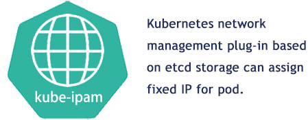

The IP address of pod can be fixed, and kubernetes dynamic IP network allocation management plug-in based on etcd distributed storage is used.kube-ipam allocates ip addresses out of a set of address ranges.It stores the state locally on the remote etcd, therefore ensuring uniqueness of IP addresses in a cluster.Optionally, it can include a DNS configuration from a resolv.conf file on the host.

<br>



<br>

# 1  Install kube-ipam：
kube-ipam binary program files can be obtained by <a href="docs/download.md">download</a> or <a href="docs/build.md">compile</a>, and copy the kube-ipam binary to the `/opt/cni/bin/` directory
```
tar -zxvf kube-ipam-x86.tgz
mv kube-ipam /opt/cni/bin/kube-ipam
```

# 2  /etc/cni/net.d network configuration

## 2.1  Configure IP subnet and etcd storage

The IP subnet information of pod is set by `subnet` parameter, and the gateway of pod is set by `gateway` parameter.You can configure the etcd address and certificate to be stored in kubernetes pod IP address in `etcdConfig` parameter.

Edit `/etc/cni/net.d/1-kube-ipam.conf` files on all kubernetes node servers.

```

{
        "cniVersion":"0.3.1",
        "name": "k8snetwork",
        "type": "macvlan",
        "master": "eth1",
        "ipam": {
                "name": "kube-subnet",
                "type": "kube-ipam",
                "etcdConfig": {
                        "etcdURL": "https://192.168.1.50:2379",
                        "etcdCertFile": "/etc/kubernetes/ssl/etcd.pem",
                        "etcdKeyFile": "/etc/kubernetes/ssl/etcd-key.pem",
                        "etcdTrustedCAFileFile": "/etc/kubernetes/ssl/ca.pem"
                },
                "subnet": "10.188.0.0/16",
                "rangeStart": "10.188.0.10",
                "rangeEnd": "10.188.0.200",
                "gateway": "10.188.0.1",
                "routes": [{
                        "dst": "0.0.0.0/0"
                }],
                "resolvConf": "/etc/resolv.conf"
        }
}


```


## 2.2  Configuration parameter description

* `type` (string, required): fill in your CNI plug-in type, such as macvlan, ipvlan, kube-router, bridge, etc.
* `routes` (string, optional): list of routes to add to the container namespace. Each route is a dictionary with "dst" and optional "gw" fields. If "gw" is omitted, value of "gateway" will be used.
* `resolvConf` (string, optional): Path to a `resolv.conf` on the host to parse and return as the DNS configuration
* `ranges`, (array, required, nonempty) an array of arrays of range objects:
	* `subnet` (string, required): CIDR block to allocate out of.
	* `rangeStart` (string, optional): IP inside of "subnet" from which to start allocating addresses. Defaults to ".2" IP inside of the "subnet" block.
	* `rangeEnd` (string, optional): IP inside of "subnet" with which to end allocating addresses. Defaults to ".254" IP inside of the "subnet" block for ipv4, ".255" for IPv6
	* `gateway` (string, optional): IP inside of "subnet" to designate as the gateway. Defaults to ".1" IP inside of the "subnet" block.
* `etcdConfig`, an object of etcd address info
  * `etcdURL` (string, required): The URL of etcd
  * `etcdCertFile` (string, required): The cert file of etcd
  * `etcdKeyFile` (string, required): The key file of etcd
  * `etcdTrustedCAFileFile` (string, required): The ca file of etcd


<br>
<br>


# 3  Kubernetes fixed pod IP address

## 3.1  Fixed pod IP configuration
The fixed allocation of pod IP address can be realized by configuring `kube-ipam.ip`, `kube-ipam.netmask` and `kube-ipam.gateway` parameters in annotations.
<br>
In `/etc/cni/net.d/1-kube-ipam.conf`,The range of the pod IP address is set in `rangestart` and `rangeend`.But if you need to keep the pod IP address fixed, please do not set the value of `kube-ipam.ip` within this range.
<br>
Edit `fixed-ip-test-Deployment.yaml` , which is used to create a fixed IP pod:

```
# cat fixed-ip-test-Deployment.yaml
---
apiVersion: apps/v1
kind: Deployment
metadata:
  name: fixed-ip-test
  namespace: default
  labels:
    k8s-app: cloudnativer-test
spec:
  replicas: 1
  strategy:
    type: RollingUpdate
    rollingUpdate:
      maxUnavailable: 1
  selector:
    matchLabels:
      k8s-app: cloudnativer-test
  template:
    metadata:
      labels:
        k8s-app: cloudnativer-test
      annotations:
        kube-ipam.ip: "10.188.0.216"
        kube-ipam.netmask: "255.255.0.0"
        kube-ipam.gateway: "10.188.0.1"
    spec:
      containers:
      - name: fixed-ip-test
        image: nginx:1.7.9
        imagePullPolicy: IfNotPresent
        ports:
        - name: http
          containerPort: 80  
---

```
Note that at present, Kube-ipam only supports the fixed IPv4 address, and we will provide the fixed IPv6 address function in the future.


## 3.2  Create a fixed IP pod

Use the `kubectl apply` command to create a fixed IP pod:

```
# kubectl apply -f fixed-ip-test-Deployment.yaml
#
# kubectl get pod -o wide
  NAME                             READY   STATUS    RESTARTS   AGE     IP             NODE   
  fixed-ip-test-6d9b74fd4d-dbbsd   1/1     Running   0          2d23h   10.188.0.216   192.168.1.66

```
At this point, the fixed-ip-test-6d9b74fd4d-dbbsd is fixed to 10.188.0.216.


## 3.3  After rescheduling, the pod IP remains unchanged

Use the `kubectl delete` command to delete this pod, and kuberntes will automatically start a new fixed IP test pod:

```
# kubectl delete pod fixed-ip-test-6d9b74fd4d-dbbsd
#
# kubectl get pod -o wide
  NAME                             READY   STATUS    RESTARTS   AGE   IP             NODE   
  fixed-ip-test-6d9b74fd4d-xjhek   1/1     Running   0          1h    10.188.0.216   192.168.1.66

```
At this time, the IP address of the newly started fixed-ip-test-6d9b74fd4d-xjhek is still 10.188.0.216.
<br>


