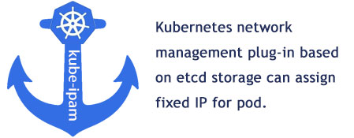

Kube-ipam基於etcd分佈式存儲實現kubernetes動態IP網絡分配管理，確保集羣中IP地址的唯一性。 Kube-ipam支持給kubernetes集羣中的Pod固定IP地址，同時支持resolv.conf的DNS配寘。

<br>



<br>

切換語言：<a href="README0.2.md">English Documents</a> | <a href="README0.2-zh-hk.md">繁體中文檔案</a> | <a href="README0.2-zh.md">简体中文文档</a> | <a href="README0.2-jp.md">日本語の文書</a>

<br>
<br>

# [1] 概述

一些場景往往對IP地址有依賴，需要使用固定IP地址的Pod，可以使用kube-ipam輕鬆解决這類問題。 例如，mysql主從架構的時候，主database與從database之間的同步； 例如keepalived做集羣HA的時候，兩個節點之間檢測通信等； 例如某些安全防護設備，需要基於IP地址進行網路安全訪問策略限制的場景等。
<br>


<br>

`Kube-ipam`基於etcd分佈式存儲實現kubernetes動態IP網絡分配管理，確保kubernetes集羣中的Pod擁有固定的IP地址。 在使用kube-ipam配寘之後，上圖中的fixed-ip Pod在銷毀重建之後仍然可以保持原有IP地址的固定不變。


<br>
<br>


# [2] 安裝kube-ipam

你可以通過<a href=“docs/download.md”>下載</a>或<a href=“docs/build.md”>編譯</a>獲得`kube-ipam`的二進位檔案，然後將kube-ipam的二進位檔案拷貝到kubernetes node主機的`/opt/cni/bin/`目錄中。

```
# wget https://github.com/cloudnativer/kube-ipam/releases/download/v0.2.0/kube-ipam-v0.2.0-x86.tgz
# tar -zxvf kube-ipam-v0.2.0-x86.tgz
# mv kube-ipam-v0.2.0-x86/kube-ipam /opt/cni/bin/kube-ipam
```

<br>
<br>


# [3] /etc/cni/net.d配寘

## 3.1 子網和etcd配寘

你可以通過`subnet`參數設置IP子網資訊，通過`gateway`設定閘道資訊。 你可以通過`etcdConfig`配寘etcd的證書和endpoint地址。

編輯所有kubernetes node主機的`/etc/cni/net.d/1-kube-ipam.conf`檔案。

```
# cat /etc/cni/net.d/1-kube-ipam.conf
{
        "cniVersion":"0.3.1",
        "name": "k8snetwork",
        "type": "macvlan",
        "master": "eth1",
        "ipam": {
                "name": "kube-subnet",
                "type": "kube-ipam",
		"kubeConfig": "/etc/kubernetes/pki/kubectl.kubeconfig"
                "etcdConfig": {
                        "etcdURL": "https://192.168.1.50:2379,https://192.168.1.58:2379,https://192.168.1.63:2379",
                        "etcdCertFile": "/etc/kubernetes/pki/etcd.pem",
                        "etcdKeyFile": "/etc/kubernetes/pki/etcd-key.pem",
                        "etcdTrustedCAFileFile": "/etc/kubernetes/pki/ca.pem"
                },
                "subnet": "10.188.0.0/16",
                "rangeStart": "10.188.0.10",
                "rangeEnd": "10.188.0.200",
                "gateway": "10.188.0.1",
                "routes": [{
                        "dst": "0.0.0.0/0"
                }],
                "resolvConf": "/etc/resolv.conf"
        }
}


```


## 3.2 配寘參數說明

* `type` (string, required): 填写CNI插件的类型, 例如 macvlan、ipvlan、kube-router、bridge等。
* `routes` (string, optional): 要添加到容器命名空间的路由列表。 每个路由都是一个带有“dst”和可选“gw”字段。 如果省略“gw”，将使用“网关”的值。
* `resolvConf` (string, optional): 主机上要解析并作为 DNS 配置返回的 `resolv.conf` 文件路径。
* `ranges`, (array, required, nonempty) an array of arrays of range objects:
	* `subnet` (string, required): 要分配出去的 CIDR 块。
	* `rangeStart` (string, optional): 从`subnet`子网内开始分配的IP地址，默认为`subnet`子网段内的“.2”这个IP地址。
	* `rangeEnd` (string, optional): 从`subnet`子网内结束分配的IP地址，默认为`subnet`子网段内的“.254”这个IP地址。
	* `gateway` (string, optional): 从`subnet`子网内分配的网关IP地址，默认为`subnet`子网段内的“.1”这个IP地址。
* `etcdConfig`：etcd 地址信息的对象
  * `etcdURL` (string, required): etcd的endpoint URL地址。
  * `etcdCertFile` (string, required): etcd的cert文件。
  * `etcdKeyFile` (string, required): etcd的key文件。
  * `etcdTrustedCAFileFile` (string, required): etcd的ca文件。


<br>
<br>


# [4] Kubernetes固定IP容器方法

## 4.1 固定IP地址配寘

pod IP地址的固定分配可以通過在pod的`annotations`中配寘`kube-ipam.ip`、`kube-ipam.netmask`和`kube-ipam.gateway`參數來實現。
<br>
在`/etc/cni/net.d/1-kube-ipam.conf`中，隨機IP地址的範圍在`rangestart`和`rangeend`中設定。 沒有設定在`rangestart`和`rangeend`中IP地址段，可以手工分配給固定IP的容器。
<br>
換句話說，如果你需要保持pod的IP地址固定不變，請不要將`kube-ipam.ip`的值設定在此`rangestart`和`rangeend`範圍內。
<br>
新建一個`fixed-ip-test-Deployment.yaml`，用來創建一個固定IP的Pod:

```
# cat fixed-ip-test-Deployment.yaml
---
apiVersion: apps/v1
kind: Deployment
metadata:
  name: fixed-ip-test
  namespace: default
  labels:
    k8s-app: cloudnativer-test
spec:
  replicas: 1
  strategy:
    type: RollingUpdate
    rollingUpdate:
      maxUnavailable: 1
  selector:
    matchLabels:
      k8s-app: cloudnativer-test
  template:
    metadata:
      labels:
        k8s-app: cloudnativer-test
      annotations:
        kube-ipam.ip: "10.188.0.216"
        kube-ipam.netmask: "255.255.0.0"
        kube-ipam.gateway: "10.188.0.1"
    spec:
      containers:
      - name: fixed-ip-test
        image: nginx:1.7.9
        imagePullPolicy: IfNotPresent
        ports:
        - name: http
          containerPort: 80  
---

```

在本例中，我們可以使用10.188.0.0/16網段中，除了10.188.0.10～10.188.0.200之外的IP地址來分配給Pod。
<br>
說明：如果想要創建隨機IP的Pod，只需要去掉annotations的`kube-ipam.ip`、`kube-ipam.netmask`和`kube-ipam.gateway`配寘即可。
<br>

## 4.2 創建一個固定IP的Pod

使用`kubectl apply -f`命令來創建固定IP的Pod:

```
# kubectl apply -f fixed-ip-test-Deployment.yaml
#
# kubectl get pod -o wide
  NAME                             READY   STATUS    RESTARTS   AGE     IP             NODE   
  fixed-ip-test-6d9b74fd4d-dbbsd   1/1     Running   0          2d23h   10.188.0.216   192.168.20.21

```
現在，這個fixed-ip-test-6d9b74fd4d-dbbsd這個Pod就被分配了一個固定不變的IP地址（10.188.0.216）。

## 4.3 銷毀重建Pod，IP保持固定不變

例如我們使用`kubectl delete`命令來删除上面這個Pod，kubernetes會自動重建一個新的Pod：

```
# kubectl delete pod fixed-ip-test-6d9b74fd4d-dbbsd
#
# kubectl get pod -o wide
  NAME                             READY   STATUS    RESTARTS   AGE   IP             NODE   
  fixed-ip-test-6d9b74fd4d-xjhek   1/1     Running   0          1h    10.188.0.216   192.168.30.35

```
此時，新啟動的fixed-ip-test-6d9b74fd4d-xjhek這個Pod的IP地址依然是10.188.0.216。

<br>
<br>

# [5] 查看日誌資訊

查看kubernetes node主機上的`/var/log/kube-ipam.log`檔案，可以獲取`kube-ipam`的系統日誌資訊。

<br>
<br>

# [6] 實現Web和資料庫分層網路安全訪問架構

<br>

我們可以基於`kube-ipam`與`Multus`實現Web和資料庫分層網路安全訪問架構，讓一個Pod同時支持隨機IP和固定IP等多個網路介面。 這樣的部署管道有利於安全人員把應用網絡和資料庫等多個網絡區域進行相互隔離，有效控制容器集羣網絡架構。

<br>


<br>

上圖中顯示了每個Pod具有2個介面：eth0、net1。 eth0作為外界用戶訪問web pod的網路介面； 而net1是附加的容器網卡，作為web Pod到database Pod的內部網路通信。
<br>
用戶可以通過ingress或service來訪問到web服務。 web pod可以通過database區域網絡，訪問固定IP地址的database服務。 Database區域網絡的database Pod可以互相通過固定IP地址進行集羣的通信操作。 分層網路安全訪問架構的<a href=“docs/Networksecuritylayering-zh-hk.md”>安裝與部署過程請點擊這裡查看</a>。

<br>
<br>
# [7] 歡迎提交Issues和PR

如果你在使用過程中遇到問題，可以點擊<a href=“ https://github.com/cloudnativer/kube-ipam/issues “> https://github.com/cloudnativer/kube-install/issues </a>向我們提交Issues，也可以Fork原始程式碼，然後嘗試修復BUG之後，向我們提交PR。<br>

```
# git clone your-fork-code
# git checkout -b your-new-branch
# git commit -am "Fix bug or add some feature"
# git push origin your-new-branch
```
<br>
歡迎給我們提交Issues和PR。
<br>
謝謝每一位貢獻者！

<br>
<br>
<br>


