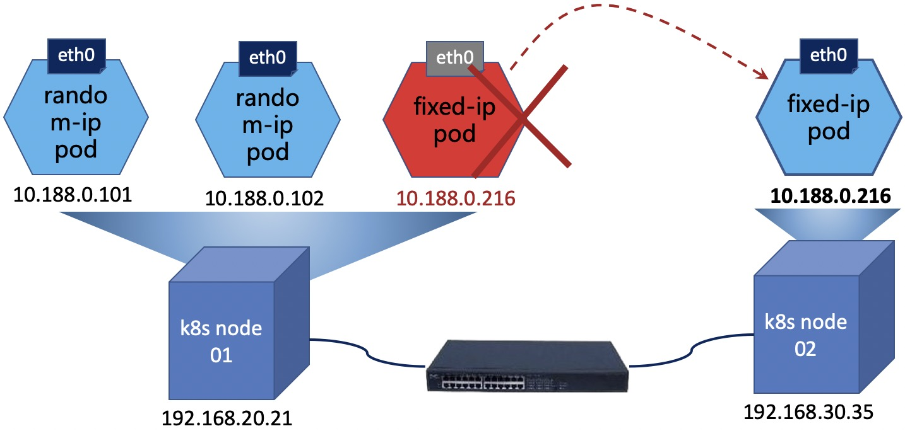
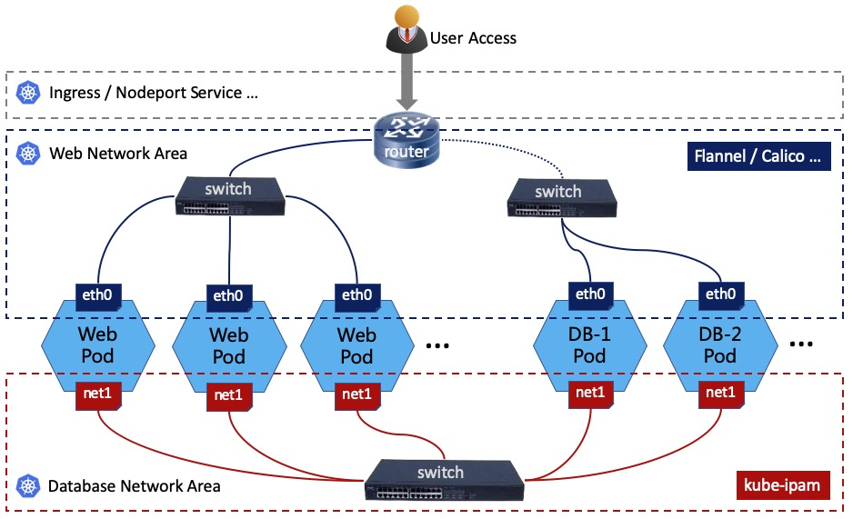

Kube-ipam基于etcd分布式存储实现kubernetes动态IP网络分配管理，确保集群中IP地址的唯一性。Kube-ipam支持给kubernetes集群中的Pod固定IP地址，同时支持resolv.conf的DNS配置。

<br>


<br>

切换语言：<a href="README0.2.md">English Documents</a> | <a href="README0.2-zh-hk.md">繁體中文檔案</a> | <a href="README0.2-zh.md">简体中文文档</a> | <a href="README0.2-jp.md">日本語の文書</a>

<br>
<br>

# [1]  概述

一些场景往往对IP地址有依赖，需要使用固定IP地址的Pod，可以使用kube-ipam轻松解决这类问题。例如，mysql主从架构的时候，主database与从database之间的同步；例如keepalived做集群HA的时候，两个节点之间检测通信等；例如某些安全防护设备，需要基于IP地址进行网络安全访问策略限制的场景等。
<br>



<br>

`Kube-ipam` 基于etcd分布式存储实现kubernetes动态IP网络分配管理，确保kubernetes集群中的Pod拥有固定的IP地址。在使用kube-ipam配置之后，上图中的fixed-ip Pod在销毁重建之后仍然可以保持原有IP地址的固定不变。


<br>
<br>


# [2]  安装kube-ipam

## 启用与配置CNI路径

请确保你的`kubelet`正确的配置了`network-plugin`、`cni-conf-dir` 和 `cni-bin-dir`参数。下面给出一个`kubelet`的配置示例供你参考：

```
# cat /etc/systemd/system/kubelet.service 
...
ExecStart=/usr/local/bin/kubelet \
...
  --network-plugin=cni \
  --cni-conf-dir=/etc/cni/net.d \
  --cni-bin-dir=/opt/cni/bin/ \
...
```

## 获取和安装kube-ipam

你可以通过<a href="docs/download.md">下载</a>或<a href="docs/build.md">编译</a>获得`kube-ipam`的二进制文件，然后将kube-ipam的二进制文件拷贝到kubernetes node主机的`/opt/cni/bin/` 目录中。

```
# wget https://github.com/cloudnativer/kube-ipam/releases/download/v0.2.0/kube-ipam-v0.2.0-x86.tgz
# tar -zxvf kube-ipam-v0.2.0-x86.tgz
# mv kube-ipam-v0.2.0-x86/kube-ipam /opt/cni/bin/kube-ipam
```

<br>
<br>


# [3] /etc/cni/net.d配置

## 3.1  子网和etcd配置

你可以通过 `subnet` 参数设置IP子网信息，通过 `gateway` 设置网关信息。你可以通过 `etcdConfig` 配置etcd的证书和endpoint地址。

编辑所有kubernetes node主机的 `/etc/cni/net.d/1-kube-ipam.conf` 文件。

```
# cat /etc/cni/net.d/1-kube-ipam.conf
{
        "cniVersion":"0.3.1",
        "name": "k8snetwork",
        "type": "macvlan",
        "master": "eth1",
        "ipam": {
                "name": "kube-subnet",
                "type": "kube-ipam",
		"kubeConfig": "/etc/kubernetes/pki/kubectl.kubeconfig"
                "etcdConfig": {
                        "etcdURL": "https://192.168.1.50:2379,https://192.168.1.58:2379,https://192.168.1.63:2379",
                        "etcdCertFile": "/etc/kubernetes/pki/etcd.pem",
                        "etcdKeyFile": "/etc/kubernetes/pki/etcd-key.pem",
                        "etcdTrustedCAFileFile": "/etc/kubernetes/pki/ca.pem"
                },
                "subnet": "10.188.0.0/16",
                "rangeStart": "10.188.0.10",
                "rangeEnd": "10.188.0.200",
                "gateway": "10.188.0.1",
                "routes": [{
                        "dst": "0.0.0.0/0"
                }],
                "resolvConf": "/etc/resolv.conf"
        }
}

```

## 3.2  配置参数说明

* `type` (string, required): 填写CNI插件的类型, 例如 macvlan、ipvlan、kube-router、bridge、calico等（还可以与`Multus`结合支持更多CNI插件）。
* `routes` (string, optional): 要添加到容器命名空间的路由列表。 每个路由都是一个带有“dst”和可选“gw”字段。 如果省略“gw”，将使用“网关”的值。
* `resolvConf` (string, optional): 主机上要解析并作为 DNS 配置返回的 `resolv.conf` 文件路径。
* `etcdConfig`：etcd 地址信息的对象
  * `etcdURL` (string, required): etcd的endpoint URL地址。
  * `etcdCertFile` (string, required): etcd的cert文件。
  * `etcdKeyFile` (string, required): etcd的key文件。
  * `etcdTrustedCAFileFile` (string, required): etcd的ca文件。
  * `kubeConfig` (string, required): kubernetes集群的kubeconfig文件。
* `ranges`, (array, required, nonempty) an array of arrays of range objects:
	* `subnet` (string, required): 要分配出去的 CIDR 块。
	* `rangeStart` (string, optional): 从`subnet`子网内开始分配的IP地址，默认为`subnet`子网段内的“.2”这个IP地址。
	* `rangeEnd` (string, optional): 从`subnet`子网内结束分配的IP地址，默认为`subnet`子网段内的“.254”这个IP地址。
	* `gateway` (string, optional): 从`subnet`子网内分配的网关IP地址，默认为`subnet`子网段内的“.1”这个IP地址。
<br>

提示：`ranges`可以支持多个子网的配置格式，详见<a href="docs/multiple-subnets.md">multiple-subnets文档</a>。


<br>
<br>


# [4]  Kubernetes固定IP容器方法

## 4.1  固定IP地址配置
pod IP地址的固定分配可以通过在pod的`annotations`中配置`kube-ipam.ip`、`kube-ipam.netmask`和`kube-ipam.gateway`参数来实现。
<br>
在`/etc/cni/net.d/1-kube-ipam.conf`中，随机IP地址的范围在`rangestart`和`rangeend`中设置。没有设置在`rangestart`和`rangeend`中IP地址段，可以手工分配给固定IP的容器。
<br>
换句话说，如果你需要保持pod的IP地址固定不变， 请不要将 `kube-ipam.ip` 的值设置在此`rangestart`和`rangeend`范围内。

<br>
新建一个`fixed-ip-test-Deployment.yaml` ，用来创建一个固定IP的Pod:

```
# cat fixed-ip-test-Deployment.yaml
---
apiVersion: apps/v1
kind: Deployment
metadata:
  name: fixed-ip-test
  namespace: default
  labels:
    k8s-app: cloudnativer-test
spec:
  replicas: 1
  strategy:
    type: RollingUpdate
    rollingUpdate:
      maxUnavailable: 1
  selector:
    matchLabels:
      k8s-app: cloudnativer-test
  template:
    metadata:
      labels:
        k8s-app: cloudnativer-test
      annotations:
        kube-ipam.ip: "10.188.0.216"
        kube-ipam.netmask: "255.255.0.0"
        kube-ipam.gateway: "10.188.0.1"
    spec:
      containers:
      - name: fixed-ip-test
        image: nginx:1.7.9
        imagePullPolicy: IfNotPresent
        ports:
        - name: http
          containerPort: 80  
---

```

在本例中，我们可以使用10.188.0.0/16网段中，除了10.188.0.10～10.188.0.200之外的IP地址来分配给Pod。
<br>
说明：如果想要创建随机IP的Pod，只需要去掉annotations的`kube-ipam.ip`、`kube-ipam.netmask`和`kube-ipam.gateway`配置即可。
<br>

## 4.2  创建一个固定IP的Pod

使用 `kubectl apply -f` 命令来创建固定IP的Pod:

```
# kubectl apply -f fixed-ip-test-Deployment.yaml
#
# kubectl get pod -o wide
  NAME                             READY   STATUS    RESTARTS   AGE     IP             NODE   
  fixed-ip-test-6d9b74fd4d-dbbsd   1/1     Running   0          2d23h   10.188.0.216   192.168.20.21

```
现在，这个fixed-ip-test-6d9b74fd4d-dbbsd这个Pod就被分配了一个固定不变的IP地址(10.188.0.216)。


## 4.3  销毁重建Pod，IP保持固定不变

例如我们使用`kubectl delete`命令来删除上面这个Pod，kubernetes会自动重建一个新的Pod：

```
# kubectl delete pod fixed-ip-test-6d9b74fd4d-dbbsd
#
# kubectl get pod -o wide
  NAME                             READY   STATUS    RESTARTS   AGE   IP             NODE   
  fixed-ip-test-6d9b74fd4d-xjhek   1/1     Running   0          1h    10.188.0.216   192.168.30.35

```
此时, 新启动的fixed-ip-test-6d9b74fd4d-xjhek这个Pod的IP地址依然是10.188.0.216。
<br>

这里还有一篇关于在`calico`CNI环境使用`kube-ipam`来固定容器IP的例子，<a href="docs/kubeipam-with-calico.md">请点击这里查看</a>！

<br>
<br>

# [5] 查看日志信息

查看kubernetes node主机上的`/var/log/kube-ipam.log`文件，可以获取`kube-ipam`的系统日志信息。

<br>
<br>

# [6] 分层网络安全架构

<br>
`kube-ipam`可以与`Multus`结合来进行组网，这样可以支持更多的CNI插件场景下的容器IP地址固定。例如，我们可以基于`kube-ipam`与`Multus`实现Web和数据库分层网络安全访问架构，让一个Pod同时支持随机IP和固定IP等多个网络接口。这样的部署方式有利于安全人员把应用网络和数据库等多个网络区域进行相互隔离，有效控制容器集群网络架构。

<br>



<br>

上图中显示了每个Pod具有2个接口：eth0、net1。eth0作为外界用户访问web pod的网络接口；而net1是附加的容器网卡，作为web Pod到database Pod的内部网络通信。

<br>

用户可以通过ingress或service来访问到web服务。web pod可以通过database区域网络，访问固定IP地址的database服务。Database区域网络的database Pod可以互相通过固定IP地址进行集群的通信操作。分层网络安全访问架构的<a href="docs/Networksecuritylayering-zh.md">安装与部署过程请点击这里查看</a>。

<br>
<br>

# [7] 欢迎提交Issues和PR

如果你在使用过程中遇到问题，可以点击<a href="https://github.com/cloudnativer/kube-ipam/issues">https://github.com/cloudnativer/kube-install/issues</a>向我们提交Issues，也可以Fork源代码，然后尝试修复BUG之后，向我们提交PR。<br>

```
# git clone your-fork-code
# git checkout -b your-new-branch
# git commit -am "Fix bug or add some feature"
# git push origin your-new-branch
```
<br>
欢迎给我们提交Issues和PR。
<br>
谢谢每一位贡献者！

<br>
<br>
<br>


