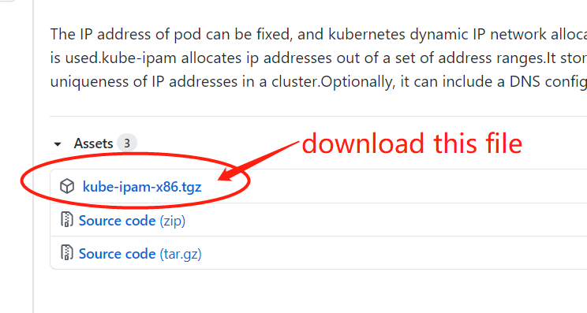

You can download the available kube-ipam binary package files <a href="https://github.com/cloudnativer/kube-ipam/releases">from here</a>:

<br>



<br>

You can also download it by executing the following command:

```
wget https://github.com/cloudnativer/kube-ipam/releases/download/v0.1/kube-ipam-x86.tgz
```

<br>

Then use the 'tar' command to extract it:

```
tar -zxvf kube-ipam-x86.tgz
```

<br>


